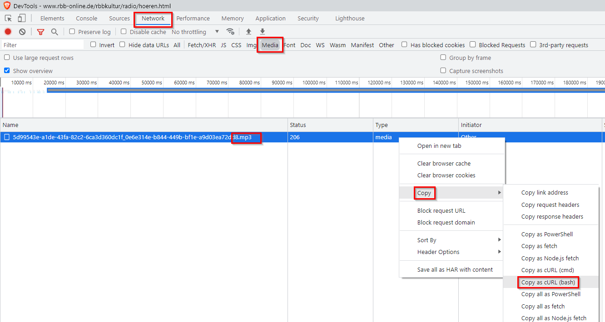

```{r setup, include=FALSE}
knitr::opts_chunk$set(echo = F)
```

# rbbKultur - Mediathek-Downloader

## // Introduction
For archival or educational purposes it might be useful to know how to download content from public radio and TV broadcasters' archives, i.e. "Mediathek".  
This only works, when the program is archived as a whole file in a convenient format like mp3 or mp4, and not in a chunked m3u streaming format.
This we will see in step 4. below. So if we encounter m3u, we will use VLC instead to capture and convert the stream, see:  
[HowTo download audio from m3u or m4s with VLC](https://www.datamercs.net/posts/2018-05-05-download-youtube-using-only-vlc/#download-video-audio-from-m3u-or-m4s-with-vlc)

## 1. select Program
* rbbKultur - Mediathek

> https://www.kulturradio.de/zum_nachhoeren/

  + chose date and program
  
## 2. inspect element
* i.e. launch _Developer Tools_
    + FireFox: CTRL+SHIFT+C
    + Chrome: CTRL+SHIFT+I

## 3. Start Mediathek player
* i.e. start the podcast or video once we have the _Developer Tools_ open, so that we can analyze the traffic under _Network_ 

## 4. back in Developer Tools
* under _Network_ right click on the _File_ (media/ mpeg)
* then _Copy URL_ or _copy as cURL_

```{r fig_example, layout="l-body-outset",fig.align = 'center'}

```

## 5. Download via bash script
* adjust script  

```{r, eval=F, echo=T}
rbb_downloader()
  {
    if [ -z "$1" ]
      then echo "Dateiname fehlt"
    elif [ -z "$2" ]
      then  "Download URL fehlt"
    else
      DWNDIR=/tmp/Downloads/AlteMusik
      AMDOWN=$1
      rbbmediapmdp=$2
      curl $rbbmediapmdp -o $DWNDIR/"$AMDOWN"
      ls -htl $DWNDIR
  fi
  }
  
# usage:
rbb_downloader "File_Name" "Download_URL"

```

* optional: save in bashrc

> C:\\cygwin64\\home\\schmalfuss\\.bashrc
  
* run
  + e.g.  
  
```{r, eval=F, echo=T}
rbb_downloader "Alte Musik - 2020-07-08 - Heinrich Isaac - Lieder und Motetten.mp3" "https://rbbmediapmdp-a.akamaihd.net/content/74/da/74da3627-5312-4f34-b681-93c48f12202d/0a858af8-b788-430b-9f5a-b5c678701a18_53d97702-265a-4586-a6d8-c8c7ad9bac80.mp3"
```


