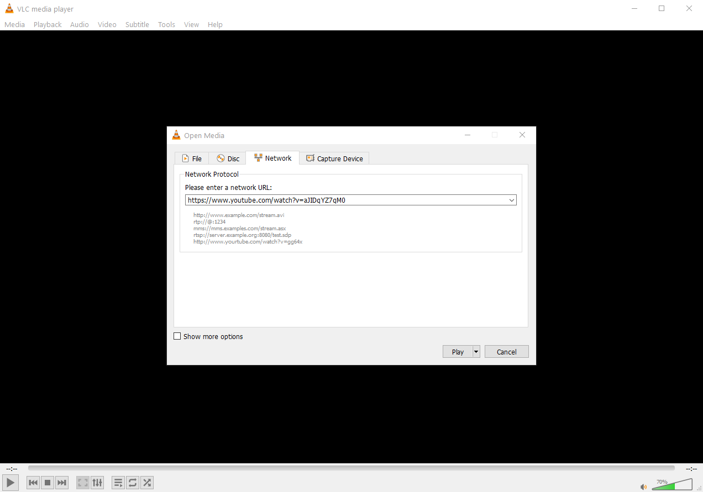

```{r setup, include=FALSE}
knitr::opts_chunk$set(echo = FALSE)
```

## // Introduction

In our [HowTo download “Mediathek” features for archival purposes](https://datamercs.net/posts/2018-04-05-rbbkultur-mediathek-downloader/) we looked into how to download features from your typical German public broadcasting *Mediathek*.  
  
We might want a similar solution to YouTube for having videos available offline, e.g. for live presentations when internet service cannot be guaranteed.  
Regrettably the same trick is not working for YouTube. Naturally, there is a multitude of browser add-ons and extensions available for downloading YouTube videos that might range from deprecated to outright malicious, but are usually somewhat obscure.  
  
But, as of writing this, there is actually nothing more needed than the popular [VLC player](https://www.videolan.org/)↗.  
VLC is a feature packed, free and open source cross-platform multimedia player and framework that plays virtually all multimedia files as well as DVDs, Audio CDs, VCDs, and various streaming protocols.  
Download here, as this is what we will use: https://www.videolan.org

## // Download originial YouTube video with VLC

VLC does not only play music or videos from disk, but is also a complete software solution for video streaming that can be used to capture and transcode media streams, such as YouTube videos!  
For information, also on the command line options see the documentation here: https://wiki.videolan.org/Documentation:Streaming_HowTo_New/  
  
For the most straight forward approach we will go as follows:

1. Open YouTube video and **copy the URL**
2. in VLC hit **Ctrl + N**
  + alternatively: Media >> Open Network Stream (Ctrl + N)
3. paste copied link as *network URL* into VLC

```{r fig_open_network_stream, layout="l-body-outset",fig.align = 'center'}

```

4. hit *Play*
5. then **Ctrl+J** to view the *Current Media Information*
  + alternatively: Tools >> Codec Information
6. Copy the URL given under **Location**

```{r fig_codec_location, layout="l-body-outset",fig.align = 'center'}
knitr::include_graphics("VLC-Codec_Location.png")
```

7. paste the copied Codec-URL back into the browser
8. right click on video and save
  + alternatively: download using `curl`

```{bash eval=F, echo=T}
$ curl "your_copied_Codec-URL_here" -o YT.mp4

```


