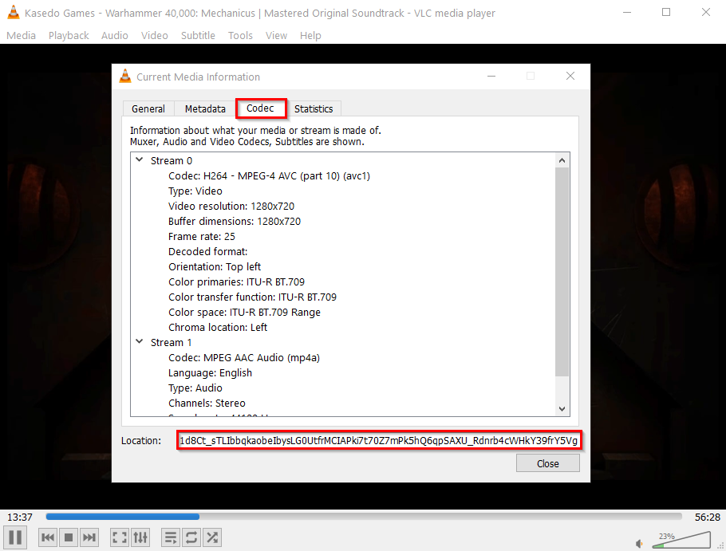
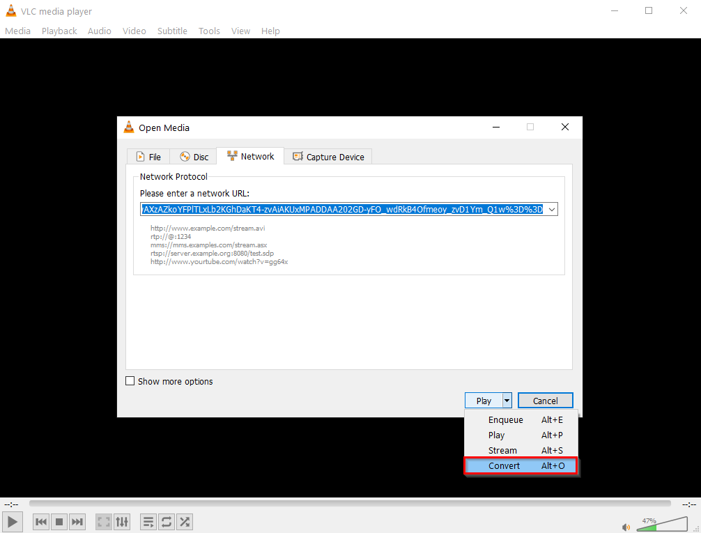

```{r setup, include=FALSE}
knitr::opts_chunk$set(echo = FALSE)
```

## // Introduction

In our [HowTo download “Mediathek” features for archival purposes](https://datamercs.net/posts/2018-04-05-rbbkultur-mediathek-downloader/) we looked into how to download features from your typical German public broadcasting *Mediathek*.  
  
We might want a similar solution to YouTube for having media available offline, e.g. for live presentations when internet service cannot be guaranteed.  
Regrettably the same trick is not working for YouTube. Naturally, there is a multitude of browser add-ons and extensions available for downloading YouTube videos that might range from deprecated to outright malicious, but are usually somewhat obscure.  
  
But, as of writing this, there is actually nothing more needed than the popular [VLC player](https://www.videolan.org/)↗.  
VLC is a feature packed, free and open source cross-platform multimedia player and framework that plays virtually all multimedia files as well as DVDs, Audio CDs, VCDs, and various streaming protocols.  
Download here, as this is what we will use: https://www.videolan.org

## // Download originial YouTube video with VLC

VLC does not only play music or videos from disk, but is also a complete software solution for video streaming that can be used to capture and transcode media streams, such as YouTube videos!  
For information, also on the command line options see the documentation here: https://wiki.videolan.org/Documentation:Streaming_HowTo_New/  
  
For the most straight forward approach we will go as follows:

1. **open YouTube video** and **copy the URL**
2. in VLC hit **Ctrl + N**
  + alternatively: *Media* >> *Open Network Stream (Ctrl + N)*
3. paste copied link as **network URL** into VLC

```{r fig_open_network_stream, layout="l-body-outset",fig.align = 'center'}

```

4. hit **Play**
  + *Achievement Unlocked*: even though not part of this tutorial, we already unlocked the option of watching YouTube videos outside of the browser - without advertisements or YT recommendations for a safe presentation mode
5. then **Ctrl+J** to view the *Current Media Information*
  + alternatively: *Tools* >> *Codec Information*
6. Copy the URL given under **Location**

```{r fig_codec_location, layout="l-body-outset",fig.align = 'center'}

```

7. paste the copied Codec-URL back the browser
8. right click on video and save
  + alternatively: download using `curl`

```{bash eval=F, echo=T}
$ curl "your_copied_Codec-URL_here" -o YT.mp4
```

## // Download audio from YouTube with VLC

Similar to the above, we can use the Codec-URL to download only the *Audio* of the video, though not by niftily extracting the original audio stream, but simply by [transcoding](https://wiki.videolan.org/Transcode/)↗, which means some quality loss of course.  
  
For downloading a MP3 off YouTube follow the steps 1-6 from above, then instead of pasting the Codec-URL back into the browser, paste the link back into VLC and instead of *play* we choose to *Convert*:

1. Open YouTube video and **copy the URL**
2. in VLC hit **Ctrl + N**
3. paste copied link as **network URL** into VLC
4. hit **Play**
5. then **Ctrl+J** to view the *Current Media Information*
6. Copy the URL given under **Location**
7. type **Ctrl + N** again
8. paste the copied Codec-URL back under **network URL**
9. instead of hitting *Play* select **Convert** from the drop down:

```{r fig_convert_1, layout="l-body-outset",fig.align = 'center'}

```

10. a new Window opens with the Codec-URL as Source
  + select **Convert** as **Audio - MP3**
  + you might want to change the conversion setting, like code or bitrate, via *Edit selected profile* first
  + choose a **destination** for the converted MP3
  + press **Start**

```{r fig_convert_2, layout="l-body-outset",fig.align = 'center'}

```

11. press **Play** again to *really* start the conversion

```{r fig_convert_3, layout="l-body-outset",fig.align = 'center'}

```

12. VLC will do the rest and show you the status in the progress bar

```{r fig_convert_4, layout="l-body-outset",fig.align = 'center'}
knitr::include_graphics("VLC-open_network_stream_4.png")
```

## // Download video | audio from m3u with VLC

The same procedures can be used to play, download or convert **M3U** streams directly in VLC.  
M3U files are basically a type of playlist, where the location of each item on the playlist is placed on a new line, and which are widely used by (German) public broadcasting for streams, instead the of un-split mp3 or mp4 files we could find otherwise in the *Mediathek*.  
For that, simply download the m3u TXT file to local or paste the m3u's link into the **network URL** again (via **Ctrl + N**) and follow the steps above.  
  