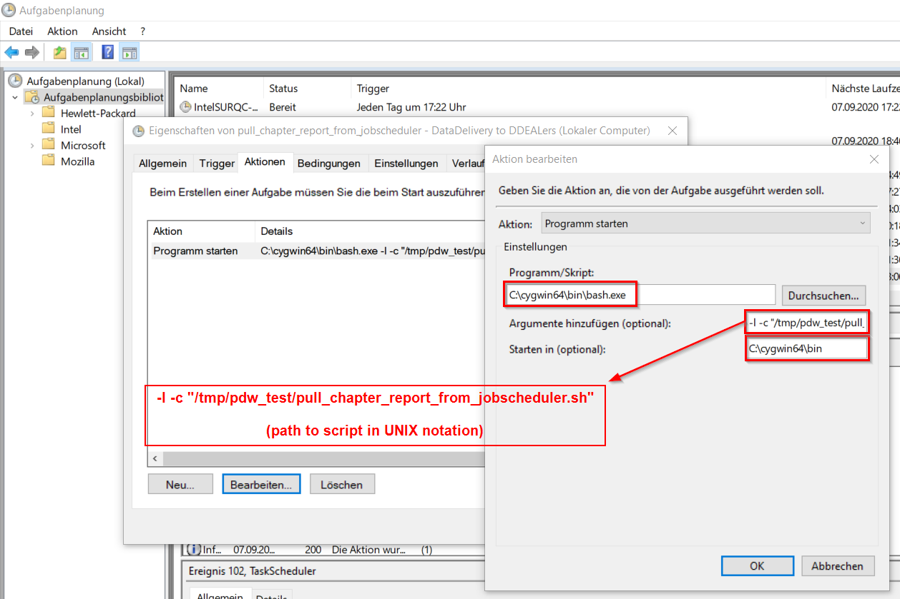

```{r setup, include=FALSE}
knitr::opts_chunk$set(echo = F)
```

# HowTo run bash script via Cygwin as Scheduled Task (i.e. "Aufgabenplanung") in Windows

For process automation it is not necessary to rely on Outlook reminders if you're on Windows and cannot (or want not) run Cron as a service to schedule scripts or programs:  
Windows brings its native service called *"Scheduled Tasks"* (or *"Aufgabenplanung"* in the German version)

## Open "Scheduled Tasks" App

* hit ``` Windows Key + R ``` to open command prompt, enter ```taskschd.msc```, which works regardless of Win version/ language
* alternatively
  + _search_ APP for either "Scheduled Task" or "Aufgabenplanung"
  + or locate the "_EXE_" in ```C:\Windows\System32\taskschd.msc```
  + ...

## Set up a new Job  
Right-click on an empty space in the Tasks' overview and select "new task" (i.e. "Einfache Aufgabe erstellen").  
In "Actions" (i.e. "Aktionen") enter the path to cygwin in the “Program/script” field, e.g.  
``` C:\cygwin64\bin\bash.exe ``` 

In the "Add arguments" box, enter "-l -c" and the full path to the bash command to run surrounded by quotes in *UNIX notation*, i.e. with forward slashes and as seen from within cygwin, and _not_ simply the Windows path, e.g.  
```-l -c "/tmp/pdw_test/pull_chapter_report_from_jobscheduler.sh" ```  

     -l: Run as if logged on at a shell
     -c: Run this command

In the "Start in" field enter  
``` C:\cygwin64\bin ```  

Add a description and give your task a meaningful name, so that when you come back to it in a year you know what it's for and you're done! 

```{r fig_example, layout="l-screen-inset",fig.align = 'center'}

```
