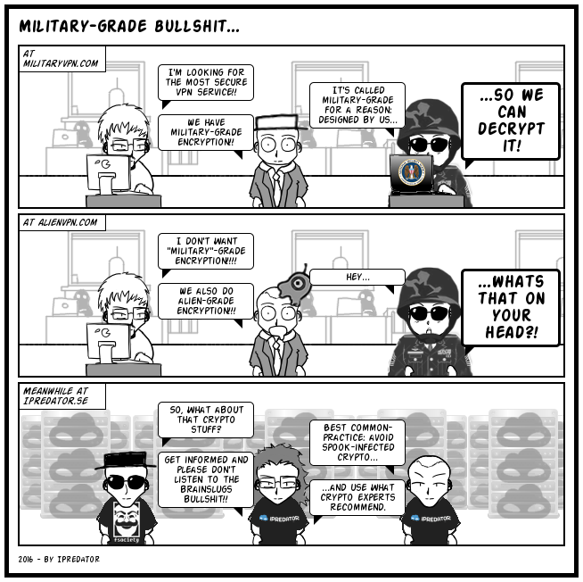
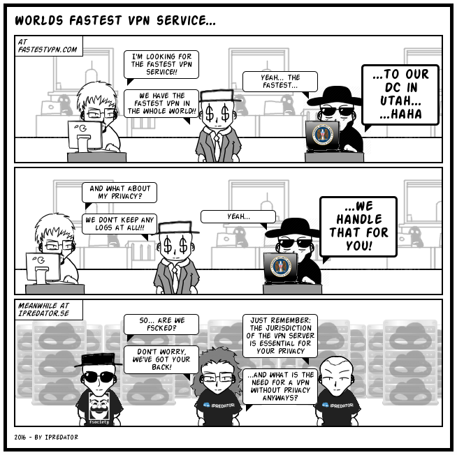
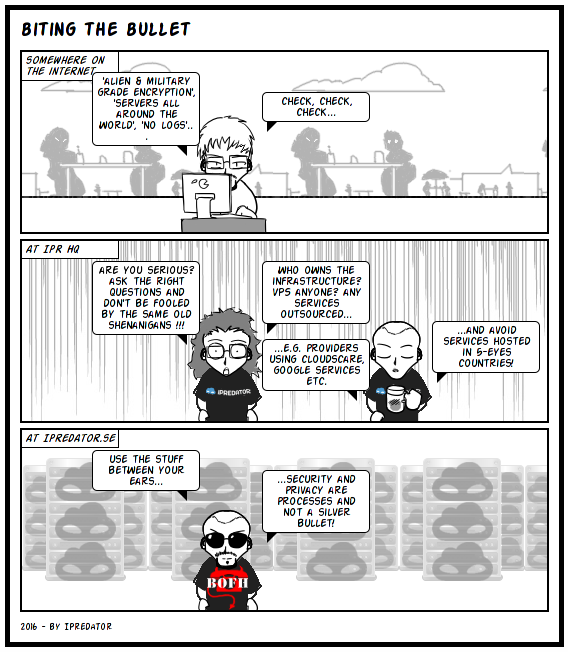
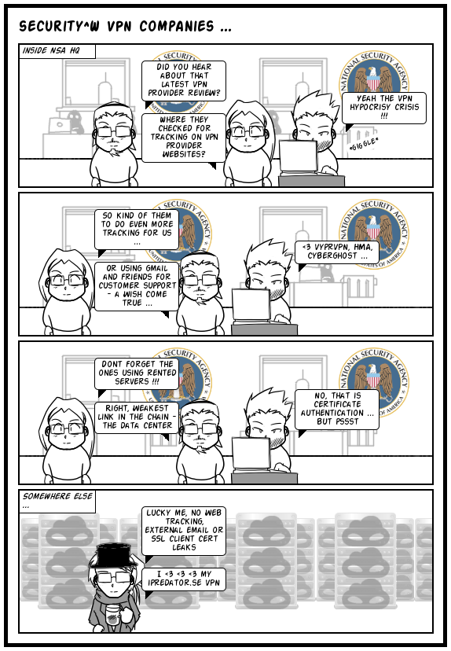
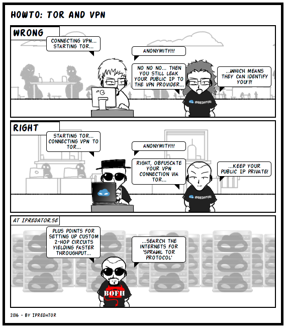
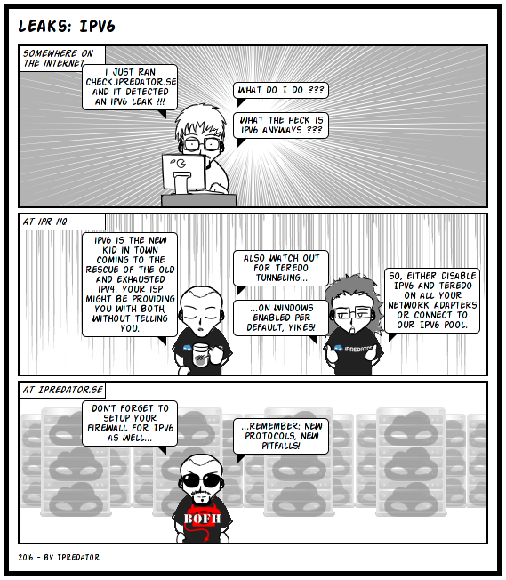
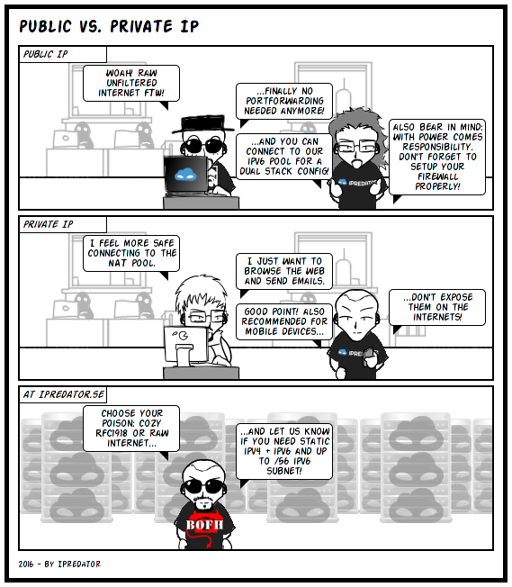
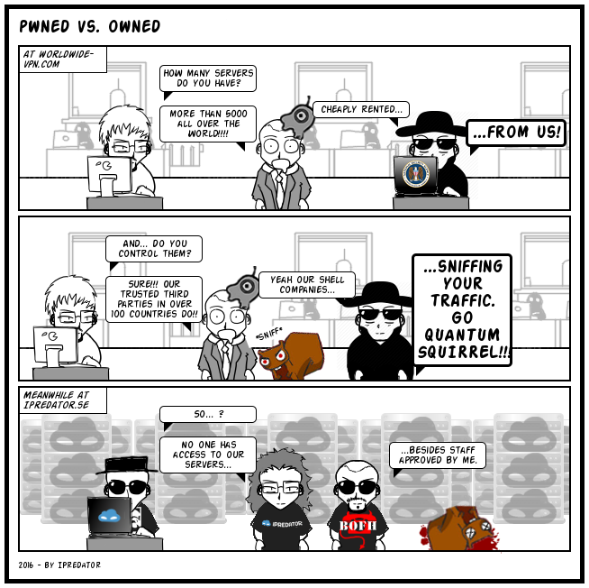

```{r setup, include=FALSE}
knitr::opts_chunk$set(echo = FALSE)
```


## Introduction

Since YouTube influencer marketing you know you need a VPN (i.e. virtual private network). There are lots of services, mostly commercial after all, but also some free and academic options.  
  
While VPNs are definitely a solution in an institutional/ company setting to access one's company's intranet remotely, or for safely circumventing national censorship and geo-blocking by streaming or national broadcasting services, there're wild claims being made when it comes to potential capabilities of VPNs or use cases.  
  
This article is not intended to deeply elaborate on that, but serves as a personal memo as well as a small thought piece in the *sanity check* below.  
  
For more knowledgeable information on VPNs, see the [EFF](https://www.eff.org/)'s article on [Choosing the VPN That's Right for You](https://ssd.eff.org/en/module/choosing-vpn-thats-right-you)↗.


## VPN Gate

[VPN Gate Academic Experiment Project](https://www.vpngate.net/en/about_overview.aspx)↗ is an online service as an academic research at Graduate School of University of Tsukuba, Japan. The purpose of this research is to expand the knowledge of "Global Distributed Public VPN Relay Servers".  
The project is not only for consumption, but anyone is encouraged to [participate](https://www.vpngate.net/en/join.aspx)↗.  
Do we trust it? No. Do we use it? For our purposes, yes.

### VPN Gate server list

list of 7000+ public VPN relay servers by volunteers around the world:

> https://www.vpngate.net/en/

> U/N: vpn  
> P/W: vpn

### VPN Client

[SoftEther VPN](https://www.softether.org/)↗ is an Open-Source, free, cross-platform multi-protocol VPN program, developed as an academic project from [University of Tsukuba](https://www.softether.org/)↗, under the Apache License 2.0.  

Download, install and set-up:

> https://github.com/SoftEtherVPN/SoftEtherVPN 


## Reality check - why you shouldn't trust VPNs

VPN advertisements are common on social media these days and making the wildest claims about privacy, security and anonymity. Basically just with the click of a button, you're safe and virtually invisible on the internet, surfing "through an unbreakable tunnel that no one can look into, be it cybercriminals, governments, or internet service providers"!?  
Naturally, this is not true, as technically one is basically only changing IPs^[Using a VPN masks the IP address assigned by your ISP from the sites that you access, adding a layer of privacy. Along with masking your origin IP address, it also encrypts your data while in transit to the site you are accessing, which actually is useful especially when connected to an insecure Wi-Fi network in a café, airport, library, or somewhere else.] and very importantly *WHO* is tracking your internet usage now. Switching (trust) from a local Internet Service provider (ISP) to another third party service with usually unclear jurisdictions.  
  
Of course, all VPN providers will claim that according to their policy they'd encrypt your data, never keep any history logs, DNS requests or other personal information and whatnot, but one should treat that as nothing more than marketing, especially when the service has any ties to any of the Five/ Fourteen Eyes alliance ([FVEY](https://en.wikipedia.org/wiki/Five_Eyes)↗) members and ask: who hasn't!?  
This question is relevant, because (remember [Upstream and PRISM](https://www.eff.org/de/pages/upstream-prism)↗!?) companies operating from any of the alliance states can be forced to spy on users without having any legal way to disclose that fact to their users, possibly bound with a gag order that cannot be violated without risking severe legal consequences (i.e. *Prism*). In *upstream* surveillance, the agencies’ partners like AT&T tap into the wires directly and copy all of the data flowing through the data highway. Of course, the companies will comply, while marketing-wise they'll phrase it such they didn't.  
Moreover, even if a service operates from a safe haven, what about their (physical) infrastructure: does the VPN provider actually OWN those machines? Or are they rather outsourced and rented from a 3rd party located in a 3rd (or even 4th) party network, or running services on virtual machines hosted by third parties? Does anyone believe that VPN providers can easily offer exit machines in two dozen countries by deploying hardware they own and operate in datacentres they can trust?  
In an ideal setting, your VPN provider owns all of the hardware AND the network it operates, yet, after all, most VPN providers are primarily businesses! And the primary objective of most businesses is revenue and driving costs down...  
As a result, one of the easiest ways to infiltrate and exploit VPN infrastructure is simply to offer cheap (possibly even tax-payer subsidised) server hosting, "tailored for your company's needs".  
And even worse, some "VPN" services are simply outright [scams](https://privacysavvy.com/vpn/guides/vpn-scams/)↗.  
  
Besides unscrupulous organizations that make online privacy harder for the general population, like the various government agencies wiretapping and breaking into systems to steal our data, or ISP/ VPN services that mess with user traffic and inject ads to earn some extra revenue by exploiting their customers for advertising, the technology itself is not inherently safe easy to deal with either, e.g. due to

* [DNS leaks](https://dnsleaktest.com/)↗, [IPv6 leaks](https://ipv6leak.com/)↗
* Problems with the cryptographic routines used, like
  + [OpenSSL](https://www.openssl.org/news/vulnerabilities.html)↗, such as Heartbleed, POODLE, FREAK, Logjam etc.
  + the literal [VULCANDEATHGRIP](http://arstechnica.com/tech-policy/2014/12/nsa-has-vpns-in-vulcan-death-grip-no-really-thats-what-they-call-it/)↗
  + ...
* Browser related [leaks](https://panopticlick.eff.org/)↗ and bad [crypto config](https://www.howsmyssl.com)↗
* Un- or improperly configured firewalls
* [browser fingerprinting](https://sec.eff.org/glossary/browser-fingerprint)↗, ad- and social media network tracking
* malicious websites or compromised networks
* etc

Again, for more knowledgeable information see the [EFF](https://www.eff.org/)'s guide on [Choosing the VPN That's Right for You](https://ssd.eff.org/en/module/choosing-vpn-thats-right-you)↗.

### But what's the solution to VPNs?

* don't fall for it and manage your expectations accordingly
* [TOR](https://www.torproject.org/)↗ might come handy as well
* Treat every service on the internet as if they had an API to Big Brother, which they most likely do. While it looks inconspicuous on the front end, in the back-end your data might already be consolidated.
* operate in *meat-space*
* visit a library!

### All you need to know about Very Pwnable Networks (VPNs)

While primarily intended as advertisements for their VPN service "[IPredator](https://en.wikipedia.org/wiki/IPredator)", co-founded by Pirate Bay co-founder Peter Sunde, the comics actually raised some valid points to consider, that obviously largely served as the inspiration for the above.  
As neither their site nor their services are available any longer, this "comic" (or "textbook"!?) can now be found below again for educational purposes:  

```{r pic_bullshit_vpn, layout="l-body-outset",fig.align = 'center'}

```

```{r pic_fastest_vpn, layout="l-body-outset",fig.align = 'center'}

```

```{r pic_biting_the_bullet, layout="l-body-outset",fig.align = 'center'}

```

```{r pic_vpntracking, layout="l-body-outset",fig.align = 'center'}

```

```{r pic_howto_vpn_vs_tor, layout="l-body-outset",fig.align = 'center'}

```

```{r pic_leaks_ipv6, layout="l-body-outset",fig.align = 'center'}

```

```{r pic_public_vs_private_ip, layout="l-body-outset",fig.align = 'center'}

```

```{r pic_pwned_vs_owned, layout="l-body-outset",fig.align = 'center'}

```

