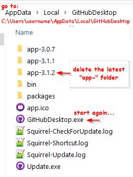

```{r setup, include=FALSE}
knitr::opts_chunk$set(echo = FALSE)
```

## // Issue
GitHub Desktop seems to be launching on double click, but no UI window opens.  
  
While this issue can be traced back for quite some years now, it happened to me only recently now on  

> GitHub Desktop Version 3.1.2 (x64)  
> Windows 10 Pro

and the suggested "solution" [here](https://github.com/desktop/desktop/issues/3757) is still working.  

And so this is just a personal reminder for future reference.

## // Solution

1. go to `C:\Users\username\AppData\Local\GitHubDesktop`
2. delete the most recent "app-" folder - and only this one
3. restart GitHub Desktop

### // tldr;

```{r pic_tldr, fig.align = 'center'}

```


