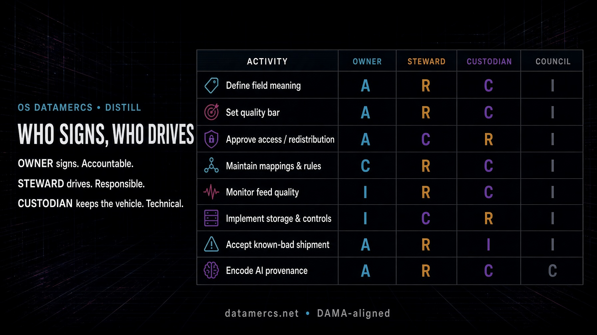

```{r setup, include=FALSE}
knitr::opts_chunk$set(
  echo = FALSE,
  message = FALSE,
  warning = FALSE,
  fig.align = "center",
  out.width = "100%"
)
```

The payload has a name on it. If it has two names, or none, it sits on the dock.

That is the whole argument. Catalogues, ONIX feeds, KBART files, contributor graphs, usage reports, AI provenance - none of them fail first as technology. They fail when a quality incident lands and the room starts asking who is supposed to move.

Most vendor explainers flatten this into a two-role cartoon: owner versus steward, accountability versus responsibility, job done. Useful as far as it goes. It does not go far enough for a metadata shop. DAMA already had a more awkward, more accurate sentence. The rest of this piece is that sentence made operational.

```{r fig-raci, fig.cap="Figure 1. Metadata RACI - who signs, who drives. One A per row. Owner signs, steward drives, custodian keeps the vehicle."}

```

## In plain terms

Forget job titles for a minute. Think of a weekly ONIX drop, a KBART file, a MARC pipeline.

- Someone has to **decide** whether a dirty file ships. That person **signs**. That is the owner.
- Someone has to **keep the file from being dirty in the first place**, and chase it when it is. That person **drives**. That is the steward.
- Someone has to **keep the pipe that moves the file from falling over**. That person does not choose the destination. That is the custodian.

The usual shorthand in data governance: the owner is **strategy**, the steward is **tactical execution**. One sets the destination and accepts the risk. The other runs the route, every day.

If you cannot point at three names - or two names wearing three hats - you do not have governance. You have a shared drive and a prayer.

A useful test: when a library partner writes “this ISSN is wrong”, who is the first human who must move, and who is the human whose name is on the outcome if nobody moves? If the answer is “the data team”, you have already lost. “The data team” is not a signature.

**RACI**, since the letters otherwise sit there unexplained: **R**esponsible does the work. **A**ccountable owns the outcome - one per activity. **C**onsulted before the decision. **I**nformed after. That is all it is. A grid so “who decides” is not answered by whoever is loudest that afternoon.

## What the market keeps getting wrong

A few distortions show up in almost every explainer, job advert and internal slide.

**Owner and steward as two species.** Convenient. Slightly false. DAMA-DMBOK says the owner *is* a business data steward who has approval authority in a domain. Ownership is stewardship with the pen. You still split **A** and **R** on the shop floor because a feed on fire at 16:40 does not care about ontology. Pretending the book invented two separate professions is how you hire a “Head of Data Ownership” who cannot refuse a sales request.

**IT as owner because IT holds the database.** Custody is not ownership. The garage does not own the cargo. The person who can restore last night’s dump is not the person who may say the dump must not ship.

**One hero, two hats, no names.** Small houses do this and survive. What kills the model is leaving the hats unnamed so that, under pressure, both vanish. “We all own the data” is the most expensive sentence in the building.

**Quality as one task.** It is not. Defining what “published date” means, setting the error bar, approving who may have the file, writing the mapping, watching the feed, running the store, accepting a known-bad shipment, and encoding AI provenance are eight different labours. Stuffing them into a cell labelled “data quality” is how RACI becomes wallpaper.

**Tooling as the operating model.** A catalogue that stores an owner field is not ownership. An alerting product that pages a steward is not stewardship. If the name is only in the SaaS tenant and not on the job, the ticket queue and the export, you have decorated the dock.

**Shared A.** Three directors who can each say “not really my call”. That is zero owners. The article-shaped internet is strangely shy about saying this plainly.

## What DAMA actually says

DAMA International’s *Data Management Body of Knowledge* (DMBOK2, revised) treats **stewardship** as the work of managing data assets on behalf of the organisation and in the interest of all stakeholders. It is not a job-board fashion. It is the operating doctrine.

Two points the market flattens:

1. A **data owner** is, in DAMA’s wording, *a business data steward who has approval authority for decisions about data within their domain*. Ownership is not a separate species.
2. Stewardship comes in types - enterprise, business, technical, coordinating. The person who knows what “active title” means in the trade list is not the same person who writes the validation rule that rejects a malformed 020. Pretending they are saves a line in an org chart and costs you a year.

Use DAMA for the ontology. Use RACI for the shift.

## The data owner

A data owner is a senior business-side leader accountable for a defined domain: product metadata, licensee data, holdings, identifiers, usage, rights, AI-assisted content. Pick a bounded estate, not “all data”.

Their name is on the outcome when that estate is wrong, misused, or quietly rotting.

They do this:

- Set policy and acceptable use. Who may extract the ONIX? Under which licence? What counts as a violation?
- Approve access and redistribution. They sign. Someone else provisions.
- Define the quality bar. What does “good enough to ship to Nielsen, library partners, the discovery layer” mean? What error rate is tolerated?
- Accept risk. Ship the KBART with a known gap, or hold the file and take the commercial hit. That call is theirs.
- Own business value. Not “is the file present”, but “is this domain actually usable for the business we claim to run”.

This is not a full-time technical post. A couple of hours a week plus availability when an incident needs a decision is a sane estimate. If your owners are writing XSLT and arguing about MARC indicator values, the role has drifted into someone else’s job.

Typical holders: head of product, editorial director, head of library sales, rights lead, catalogue owner. Not the DBA. Not the intern who “knows the spreadsheet”.

In RACI terms the owner is **A**. One A. Strategy. Destination and risk.

## The data steward

A data steward executes governance for the domain. Where the owner decides, the steward does. Strategy versus tactical execution, in the sentence every governance briefing eventually reaches.

DAMA frames this as operational execution: keep content and metadata consistent with the policies, standards and business rules the owner set. In a publishing or library operation that looks like this:

- Translate “partner X may not receive pre-pub records” into actual rules, exceptions and monitoring.
- Watch quality: completeness of identifiers, consistency of contributor forms, KBART embargo dates that match the licence, ONIX notification types that match reality.
- Keep definitions, mappings and lineage current. If “first published date” means three different things across MARC, ONIX and the web shop, that is a steward problem with an owner signature behind it.
- Triage incidents. First responder when a library reports a broken ISSN or a vendor feed starts minting duplicate work identifiers.
- Bridge the business meaning and the technical pipe. Stewards speak both.

Typical holders: senior metadata editor, catalogue manager, domain specialist who was already the unofficial “what does this field mean?” desk before anyone printed a badge.

In RACI terms the steward is **R**. Tactical execution. The route.

DAMA’s types still matter on the shop floor:

- **Business steward** - semantics, glossary, policy fit.
- **Technical steward** - rules, mappings, quality checks, metadata stores.
- **Domain steward** - one estate (identifiers, rights, usage, AI provenance).
- **Coordinating steward** - the person who stops four domains inventing four words for the same thing.

You do not need four salaries. You need four hats named, even if two of them sit on one head.

## The data custodian, because the binary is a lie

Most explainers stop at two roles and then wonder why IT and the catalogue still talk past each other.

The **custodian** is the technical role that implements and operates the controls: storage, backup, encryption, access provisioning, pipeline runtime, retention enforcement. CISSP and DAMA both recognise the split, even if they use the words with slightly different accents.

A steward defines what a valid ORCID looks like for the contributor domain. A custodian builds and runs the system that stores the record and enforces the check. Different labour. Different failure modes.

Consumers - cataloguers downstream, library partners, sales ops, the discovery index - are **I**. Informed. A good steward treats their complaints as instrumentation, not as a queue to ignore.

## Owner vs steward, without the fog

| Dimension | Data owner | Data steward |
| --- | --- | --- |
| RACI letter | **A** - Accountable | **R** - Responsible |
| Question they answer | “Is this domain fit for the business, and who decided?” | “Is the work done, correctly, today?” |
| Horizon | Strategic | Tactical execution |
| Focus | Policy, standards, risk, value | Monitoring, definitions, mappings, incidents |
| Seniority | Business leader with real authority | Domain expert / metadata lead |
| Time | Hours per week, plus decisions | Ongoing, often core to the role |
| Failure mode | Title without power | Role without time or tools |

Neither works alone. An owner with no steward has a policy and nobody to carry it. A steward with no owner has a queue and no cover when someone important wants the dirty file shipped anyway.

## How they sit in the operating model

Above them: a CDO-equivalent or a governance council. Strategy, cross-domain collisions, escalation. Identifier policy that cuts across product, rights and catalogue does not get decided in a side chat.

Beside them: custodians and consumers.

How it scales:

- **Centralised.** Small core, every decision through one desk. Fine for a house with one catalogue. Becomes a bottleneck the moment you run multiple imprints, partner feeds and a library channel.
- **Federated / mesh-shaped.** Each domain has an owner and a steward. A council holds the shared standards. Scales. Requires discipline. Most houses pretend they have this and actually have heroics.
- **Hybrid.** Central policy and tooling. Domain owners and stewards execute inside it. This is where grown programmes land.

In a small operation one person wears owner and steward for a quiet domain. That is allowed. What is not allowed is leaving the two functions unnamed.

## The operating RACI

RACI is a responsibility-assignment grid from project management. Four letters, nothing mystical:

- **R - Responsible.** Does the work.
- **A - Accountable.** Owns the outcome. Signs. One per row.
- **C - Consulted.** Asked before the decision.
- **I - Informed.** Told afterwards.

Generic charts talk about “data quality” as if it were one task. It is not. Here is a working cut for the work we actually do.

| Activity | Owner | Steward | Custodian | Council |
| --- | --- | --- | --- | --- |
| Define field meaning | **A** | **R** | C | I |
| Set the quality bar | **A** | **R** | C | I |
| Approve access / redistribution | **A** | C | **R** | I |
| Maintain mappings and rules | C | **R** | C | I |
| Monitor feed quality | I | **R** | C | I |
| Implement storage and controls | I | C | **R** | I |
| Accept a known-bad shipment | **A** | **R** | I | I |
| Encode AI provenance | **A** | **R** | C | C |

**R** does the work. **A** owns the outcome - one per row. **C** consulted before. **I** told after.

Vector copy: [`metadata-raci-who-signs-who-drives.svg`](metadata-raci-who-signs-who-drives.svg).

Two rules that keep this from becoming theatre:

1. Never two A's on one activity. If three directors can each say “not really my call”, the domain has no owner.
2. Wire the letters to systems. An owner in a slide deck and a steward in a private spreadsheet is costume jewellery. Put names on the dataset, the feed, the validation job, the ticket queue.

## Pitfalls we keep seeing

**Treating the two as the same badge.** The operational fire always wins. Strategy is what you do after inbox zero, which never arrives.

**An owner with no authority.** If they cannot refuse an access request, hold a dirty file, or enforce a definition against a loud sales lead, they are a label. Do not print the label.

**A steward with no hours and no tooling.** Stewardship bolted onto a full-time cataloguing job becomes reactive firefighting. You will get heroes. Heroes leave.

**Skipping the RACI.** Then “who decides” is answered by whoever is loudest that afternoon.

**Too many owners on one domain.** Shared A is zero A.

**Roles that never touch the pipes.** MARC jobs, ONIX exports, KBART drops, repository deposits - if the names are not on those objects, the operating model is a PDF.

**Calling IT the owner because they hold the database.** The garage does not own the cargo.

## What this looks like on a real estate

Three domains a publisher or library already has, whether they named them or not.

**Identifiers.** Owner: whoever is commercially and legally on the hook when an ISBN/ISSN/DOI collision ships. Steward: the person who maintains the assignment rules, checks uniqueness, and hunts duplicates. Custodian: the system that mints, stores and exposes the identifiers.

**Rights and access.** Owner: rights or library-sales lead. Steward: the metadata editor who keeps embargo, licence and territory consistent across ONIX, KBART and the platform. Custodian: IAM and the content-delivery stack.

**AI-assisted content and provenance.** Owner: the editorial or catalogue authority who decides how synthetic work is declared. Steward: the cataloguer who applies the MARC/ONIX practice - related work, prompter, model, human-in-the-loop - without wrecking the record. Custodian: the pipeline that preserves those fields through every transform. If the declaration dies in the next mapping, you do not have provenance. You have a press release.

Same pattern, three estates. Name them.

## Worksheet

Print or fill one domain per page. Names blank. Letters already set to the default above.

[Download the one-page RACI worksheet (PDF)](metadata-raci-worksheet.pdf)

## What to do this week

Do this in a week, not a programme office:

1. List the domains that actually move money or risk. Not fifty. Eight is already ambitious.
2. Write one sentence per domain: who signs, who drives, who keeps the vehicle.
3. Fill the RACI for the eight activities above. Argue once. Freeze it.
4. Put the names on the objects - feeds, jobs, catalogues, ticket queues.
5. Give the steward hours and a quality signal. A rule that never fires is décor.
6. Give the owner a decision channel that does not require a standing committee.
7. Review after the next incident, not after the next strategy offsite.

If you cannot complete step 2, you do not have a governance model. You have a hope.

## FAQ, stripped

**Where does the custodian sit?**  
Technical implementation and operation of controls. Not meaning. Not policy.

**Who should be owner?**  
A business-side leader with authority to refuse. If they cannot say no, they cannot own.

**Does every table need both names?**  
Every dataset needs a line back to a domain owner and a steward. Per-table bureaucracy is how programmes die. Domain assignment is how they live.

**Is this only for enterprises with a CDO?**  
No. A mid-size press with a catalogue manager and a head of product already has the raw material. What is usually missing is one sentence: who signs.

## Sources

- DAMA International, *DAMA-DMBOK2* (revised). Stewardship types and the owner as approving business steward. [dama.org](https://dama.org/)
- DAMA Dictionary of Data Management, companion vocabulary.
- Gartner, prediction that most data-and-analytics governance initiatives fail by 2027 in the absence of a real or manufactured crisis.
- OS DataMercs, *Ghost in the MARC* - what “encode AI provenance” looks like when it leaves the slide.

The rest is labour. Put a name on the payload. Drive it. Do not decorate the dock.
