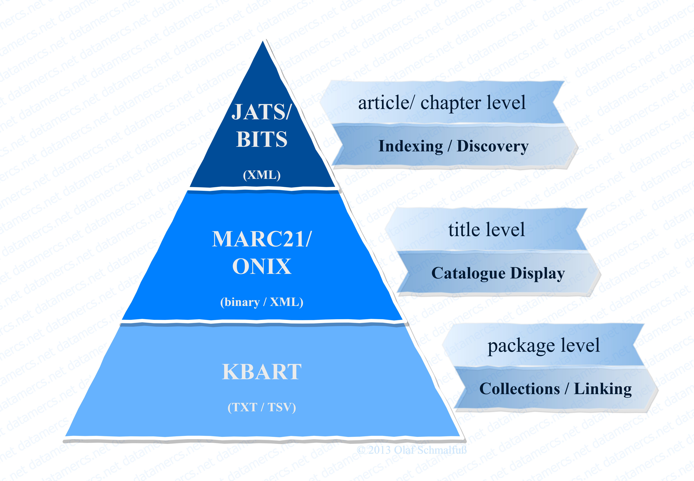

```{r setup, include=FALSE}
knitr::opts_chunk$set(echo = F)
```

# // Trinity of Discovery

The "Trinity of Discovery" exhibits our holistic approach to metadata delivery and creation, and sets the framework to a title's - may it be eBook or journal - (meta) data needs.  
It is also what most libraries would expect to receive from a publisher one way or another, either directly or through third party services or union catalogues:  
meta data and discovery from the smallest chunk down to collection level, because  

> »We are not going to buy any of your eBooks if users cannot discover them.«  
> (an unnamed head of aqcuisition)

MARC records, KBARTs, ONIX and JATS XML are key, especially to scientific publishing houses!  
Naturally, one could go beyond that, if we talked about linked data, which would even aim at the most atomic bits of data points, but since most publishers usually have hardly even the basics covered, the *trinity* shall serve as our North star here.  
Thus, this site aims to showcase several tools and workflows around that, so that even the smallest publisher, or inclined librarian, can build upon that and implement their own (half-) automated data pipelines, from ERP to .MRC;-)  

```{r fig_example, layout="l-body-outset",fig.align = 'center'}

```

